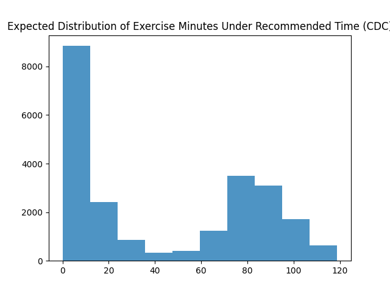
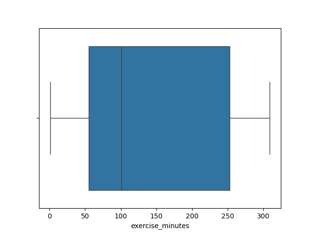

# Findings
### Associations Between `depression` and `positiveMH`, and `acadermic_success`
* Very weak association between being depressed and having less academic success
  * However, this could be due to our subjective definition of `academic_success`
    * To improve the accuracy of the `academic_success` statistic, we should ask the respondents about if their grades have changed recently and find association that way.
* No clear association between having "positive mental health" and being "academically successful"
  * The `depression` variable should perhaps take precedent over the `positiveMH` variable because the phq-9 is more objective and comprehensive.
    * It doesn't make sense to be flourishing and be depressed, so if one has depression, it should be mutually exclusive to not having positive mental health.

### Associations Between `depression` and `positiveMH` , and perceived/personal stigma
* There is a strong association between one's perception of others' and their own stigma and having positiveM mental health or depression
* An intriguing finding from the study is that students experiencing depression indicated a stronger agreement with the belief that others would view the use of mental health care negatively than the anticipated crosstable suggested. In contrast, this perception was the opposite among students not experiencing depression, highlighting that those with depression are more inclined to think that others harbor negative views about seeking mental health support.

### Probabilities: `depression` and `suicide_ideation`
* The probability of feeling depressed given that the student is experiencing suicidal ideation is 76.3%
  * Indicating that roughly 25% of students who having suicidal ideation aren't depressed
* The probability of having suicidal ideation given that one already feels depressed is 25%
  * 25% of depressed students experience suicidal ideation

### Probabilities: `depression`, `lonely`, `belonging`
* If one doesn't feel a sense of belonging in university, it's _extremely_ likely that they feel either lonely or depressed.
  * 93.5 % probability!!!
  * Universities should prioritize fostering a community that makes all students feel as if they belong! 

### Probability: `avg_parent_education`
* There is a 27.4% chance that a student's parents didn't receive any type of university or community college degree (average between the two parents) 

### More Associations
* Moderate association between average parental education level and depression
* Barely an association between exercising and depression

Relevant graphs using "educated guesses":

